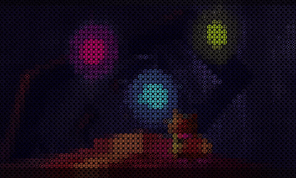
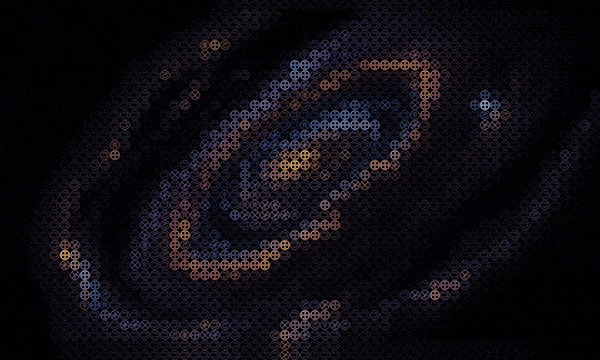

# Processing Image Grid

> An interactive image grid visualizer using the Processing library.
> Creates a grid of square images that respond to noise functions and
> user interactions to produce dynamic visual effects.

This program generates an evolving visual display by organizing small square images into a grid structure.
Each cell in the grid displays a tiny image selected from a set of grid images.
The selection and updating of these images are influenced by Perlin noise, neighbor interactions, and user input.
At every frame, the program calculates whether each cell should update based on noise values,
which simulates natural randomness.
Cells also influence their neighbors, creating patterns of frequent updates in localized areas.
User interactions, such as mouse movement, apply special effects to the grid, allowing for dynamic and
interactive visual experiences.
Parameters controlling the noise, update probabilities, neighbor influence,
and special effects can be adjusted in real-time through the ControlP5 UI,
enabling users to explore a wider range of visual outcomes.

A couple of examples of the program in action:

<p align="center">
  
</p>

<p align="center">
  
  
</p>

## Requirements

- **Java 17**
- [**Processing Core Library (core.jar)**](https://processing.org/download/)
- [**ControlP5 Library (controlP5.jar)**](https://github.com/sojamo/controlp5)
- [**Maven**](https://maven.apache.org/download.cgi)

## Setup

1. **Download Libraries:**

    - **Processing Core Library:**
        - Download `core.jar` from [Processing Download Page](https://processing.org/download/).
        - Run with the path you downloaded the file to:  
          `mvn install:install-file -Dfile=<PATH TO core.jar> -DgroupId=org.processing -DartifactId=core -Dversion=3.3.7 -Dpackaging=jar`

    - **ControlP5 Library:**
        - Download `controlP5.jar` from [ControlP5 GitHub Repository](https://github.com/sojamo/controlp5).
        - Run with the path you downloaded the file to:  
          `mvn install:install-file -Dfile=<PATH TO controlP5.jar> -DgroupId=org.sojamo -DartifactId=controlP5 -Dversion=2.3.0 -Dpackaging=jar`

2. **Images:**

    - Place your grid images in `data/image-grid/grid-elements/`.
    - Place your input images in `data/image-grid/images/`.

## Building and Running

**Build the Project:**

```bash
mvn clean compile
```

**Run the Sketch:**

```bash
mvn exec:java -Dexec.mainClass="de.yanwittmann.processing.Main"
```

## Usage

Start the program, resize the window to the desired size, and press `SPACE` to confirm window and load the images.

- `LEFT / RIGHT ARROWS`: Navigate through input images.
- `N`: Toggle debug noise visualization.
- `S`: Save the current frame as `output.png`.
- `U`: Toggle the ControlP5 UI visibility.
- Move the mouse over the canvas to apply special effects based on the selected type.

You can configure the images used by changing the images in the
`data/image-grid/grid-elements/` and `data/image-grid/images/` directories.

I really enjoy:

- configuring the image directory to be my wallpaper images collection,
- having the window in full-screen on a second monitor,
- setting the `private int globalDisplacementType = -1;` to something like `2 * 60`,
- setting the global displacement type to `1`

and just watching the patterns evolve.
Remember: you can toggle the UI with `U` and save the current frame with `S`.

## Parameters

| Parameter                           | Description                                                                                                                                                |
|-------------------------------------|------------------------------------------------------------------------------------------------------------------------------------------------------------|
| `noiseScale`                        | Controls the spatial scale of the Perlin noise. Lower values create larger, smoother patterns; higher values create finer, more detailed noise variations. |
| `noiseTimeScale`                    | Adjusts the temporal evolution of the Perlin noise. Higher values make the noise pattern change more rapidly over time.                                    |
| `minUpdateProbability`              | Sets the minimum probability for a grid cell to update in each frame, affecting the baseline activity level across the grid.                               |
| `maxUpdateProbability`              | Sets the maximum probability for a grid cell to update, allowing for more frequent changes when increased.                                                 |
| `neighborRadius`                    | Determines the radius around each cell considered its neighborhood, influencing how cells affect each other's update probabilities.                        |
| `specialEffectType`                 | Selects the type of special effect applied during mouse interaction. Different values correspond to effects like displacement or blending.                 |
| `specialEffectInfluenceRadiusLow`   | Defines the lower bound of the influence radius for special effects based on slow mouse movements, controlling how localized the effect is.                |
| `specialEffectInfluenceRadiusHigh`  | Defines the upper bound of the influence radius for special effects based on fast mouse movements, controlling how widespread the effect becomes.          |
| `setLastImageInfluence`             | Sets the initial blending influence of the previous image on the current grid cells when applying certain special effects.                                 |
| `lastImageInfluenceReductionChance` | Specifies the probability that a cell's influence from the last image will be reduced on each update, affecting how quickly the effect fades.              |
| `lastImageInfluenceReductionLow`    | Sets the minimum amount by which the last image influence is reduced when the reduction occurs.                                                            |
| `lastImageInfluenceReductionHigh`   | Sets the maximum amount by which the last image influence is reduced when the reduction occurs.                                                            |
| `specialEffectDisplacementStrength` | Controls the strength of displacement effects when applying special effects, affecting how much grid cells shift position.                                 |
| `debugVisualizeNoise`               | Toggles a debug mode that visualizes the noise values directly on the grid, useful for understanding the influence of noise on cell updates.               |
| `globalDisplacementType`            | Selects the type of global displacement applied to the grid, with different values resulting in varied movement patterns across the entire grid.           |

## License

This project is open-source and available under the [Apache License 2.0](LICENSE.txt).

## Notes

I know, a big part of the comments and JavaDoc in the code are generated by ChatGPT,
but it was either me never uploading this project,
or have it clean up the code for me so that others can look at it and at least understand something.
